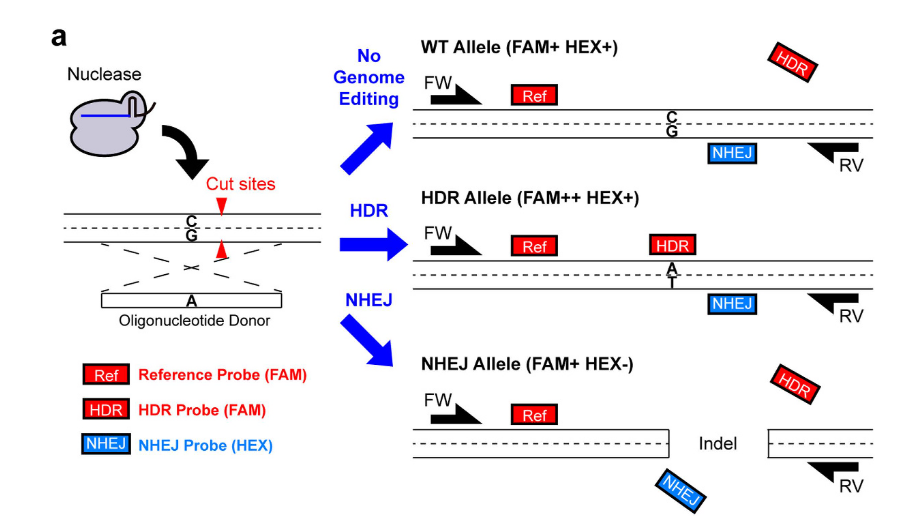
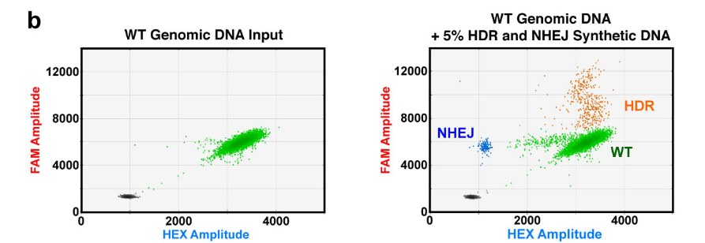

# Gene Editing with CRISPR/Cas

Digital PCR is an excellent tool for detecting and quantifying genome edits (and their frequency), introduced by CRISPR/Cas, TALEN, and other sequence-editing systems. This is because gene editing-based approaches and therapies (for example, CAR-T cell therapy) typically rely on **precise quantification** of sometimes **very-rare** edits, which can monitored **without** the need for sample **purification**.

The two most common types of sequence edits introduced by CRISPR/Cas systems are related to the cell’s repair mechanisms following sequence-strand cleavage. **NHEJ** (Non-Homologous End Joining) is the more common and less specific repair mechanism, often introducing random mutations, including indels of varying lengths. Conversely, **HDR** (Homology-Directed Repair), with the help of a donor sequence, can introduce specific modifications to the gene of interest (GOI), such as a targeted mutation. Thus, NHEJ is useful for creating gene knockouts, while HDR is valuable for introducing precise, targeted modifications to a GOI.

If working with either NHEJ- or HDR-mediated edits exclusively, I recommend referring to either [Drop off probes](/Mds/PCR-method-library/DNA-based-methods/Drop-off-Probes) or the section on Mutation detection (Discrimination assay) in the [Basics of Quantification & digital PCR Assay Design](/Mds/PCR-method-library/Basics/Basics-of-quantification-and-digital-PCR-assay-design). This is because drop-off probes are typically used to detect non-specific mutations (primarily indels) at a target site when working with NHEJ-mediated edits. In contrast, specific single-base edits can be monitored using differently labeled (e.g., FAM/HEX) probes that differ by only one nucleotide. A concise and helpful summary of ddPCR assay design for gene editing can be found in this [Bio-Rad bulletin](https://www.bio-rad.com/sites/default/files/webroot/web/pdf/lsr/literature/Bulletin_6712.pdf).

If you are investigating both types of repair mechanisms, a combined approach to detect both types of edits may be necessary. [Miyaoka et al., 2016](https://www.nature.com/articles/srep23549) provides a great example of designing gene-editing assays and tracking genome edit frequencies resulting from both NHEJ and HDR repair.

The image below illustrates the approach by Miyaoka et al. In essence:

- **No Genome Editing (WT Alleles):** Generate a 1x signal for FAM and a 1x signal for HEX.
- **HDR Alleles:** Produce partitions with a 2x signal intensity for FAM and a 1x signal for HEX. These partitions appear at higher fluorescence amplitude than both No Genome Editing (directly above No Genome Editing, in fact) and NHEJ events.
- **NHEJ Alleles:** Generate partitions with only a 1x signal intensity for FAM.

\
*source: [Miyaoka et al., 2016](https://www.nature.com/articles/srep23549), Figure 1a*

Such a combination of assays can be then successfully utilized to distinguish between unedited DNA, HDR-edited DNA, and NHEJ-edited DNA using only a two-channel system (e.g., QX200, Bio-Rad). Note the contrast (and the appearance of two additional clusters) between the unedited WT Genomic DNA only (left) and the unedited WT Genomic DNA sample, supplemented with an additional 5% HDR and NHEJ Synthethic DNA types (right).

\
*source: [Miyaoka et al., 2016](https://www.nature.com/articles/srep23549), Figure 1 b*

In summary, depending on whether you are interested in HDR or NHEJ (or both) mediated edits, assays specific to the different repair types can be easily created, adjusted and run together, using a two-channel-only digital PCR system.
