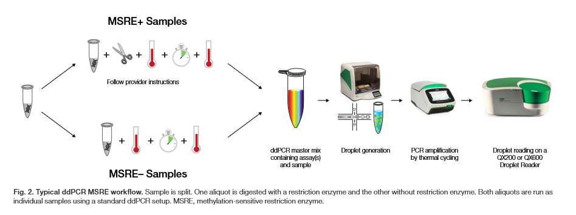

# Methylation

DNA methylation is a critical epigenetic modification that regulates gene expression and typically occurs at cytosine bases within CpG islands in the genome. Droplet digital PCR (ddPCR) can be adapted for methylation analysis through the pre-treatment of DNA templates using either bisulfite conversion or methylation-sensitive restriction enzymes (MSRE). While sodium bisulfite conversion remains the gold standard for methylation detection in PCR-based methods, it often fragments DNA due to harsh conditions involving elevated heat and pH. This leads to substantial DNA loss, necessitating a high initial DNA input.

In contrast, methylation-sensitive restriction enzymes selectively cut DNA at unmethylated sites while leaving methylated sites intact, generating distinct fragment patterns based on the methylation status of the DNA. ddPCR can then quantify methylated versus unmethylated DNA by targeting specific genomic regions. This approach enables highly sensitive and quantitative analysis of DNA methylation levels, making it particularly valuable in contexts such as cancer research and broader epigenetic studies. Moreover, MSRE-ddPCR protocols tend to be more reliable, straightforward, and time-efficient compared to bisulfite-based methods.

An example of an MSRE-ddPCR workflow is shown in the image below, adapted from Bio-Rad’s [Bulletin 3585](<https://www.bio-rad.com/sites/default/files/2024-03/Bulletin_3585.pdf>).

A notable application of the MSRE-ddPCR approach is demonstrated by [Gattuso et al., 2024](<https://www.spandidos-publications.com/10.3892/ijmm.2024.5366>), who evaluated its utility in analyzing the methylation status of the *SLC22A17* gene—a known methylation hotspot—in synthetic DNA, cell cultures, and formalin-fixed paraffin-embedded (FFPE) samples. Their study showed that even with low DNA inputs (as low as 0.625 ng), MSRE-ddPCR protocols provided a sensitive and reliable method for detecting and quantifying methylation biomarkers, highlighting their potential as a diagnostic tool.
