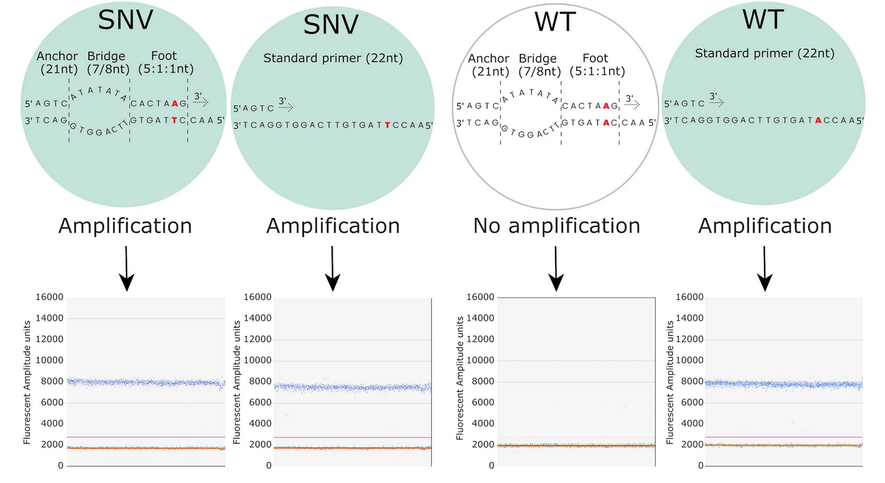

# Super Selective Primer Mediated Mutant Enrichment

An alternative strategy to mutant sequence enrichment (eg., BDA) in ddPCR experiments has been proposed by [Pablo-Fontecha and colleagues, 2023](https://www.nature.com/articles/s41598-023-39874-0). In the study, the authors describe leveraging the so-called **SuperSelective Primers** (these are specially designed primers that enable selective amplification of mutant DNA sequences over wild-type sequences). Each SuperSelective primer consists of:

- **Anchor Sequence (5′ end):** A long sequence (~20 nucleotides) that binds strongly to a conserved region upstream of the target mutation.
- **“Bridge”** sequence between the “anchor” and the “foot”. This part of the primer does not hybridize with the target sequence but rather provides a single-stranded bubble that contributes to the selective amplification of the SNV.
- **Foot Sequence (3′ end):** A very short sequence (typically 1–3 nucleotides) that includes the nucleotide at the mutation site. This short sequence ensures that the primer only efficiently binds and initiates amplification if the exact mutant sequence is present.

The design ensures that amplification occurs predominantly when the primer perfectly matches the mutant sequence, thereby minimizing amplification of wild-type sequences.

Refer to the image below for visual explanation of the **SuperSelective** primer composition:

*source: [Pablo-Fontecha et al., 2023](https://www.nature.com/articles/s41598-023-39874-0), Figure 1 modified*
