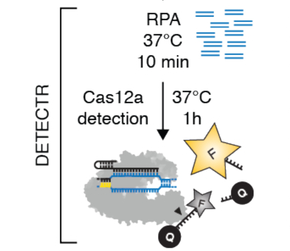

# RPA

**RPA** is a DNA amplification technique designed for rapid, sensitive, and specific nucleic acid detection under isothermal conditions (similar to LAMP), avoiding the need for thermal cycling. Initially invented by [Piepenburg et al., 2006](<https://journals.plos.org/plosbiology/article?id=10.1371/journal.pbio.0040204>), its distinguishing features are:

**Principle of Amplification**:

- RPA uses a recombinase-primer complex to facilitate homologous pairing of primers with complementary target DNA sequences.
- The recombinase binds primers and scans the target DNA for homologous sequences, enabling strand exchange and primer binding.

**Mechanism**:

- Recombinase Proteins: Form a filament with primers to guide them to their complementary sequences on the target DNA.
- Single-Strand Binding (SSB) Proteins: Stabilize the displaced single strand during primer binding.
- DNA Polymerase: Extends the primers and displaces the downstream strand, enabling continuous amplification at a constant temperature (37–42°C).

**Products**:

- RPA generates amplified DNA fragments in a sequence-specific manner. Amplification is exponential and can be detected in real-time or endpoint assays using fluorescent probes, lateral flow strips, or gel electrophoresis (refer to the original paper).

**Advantages**:

- Speed: Amplification occurs rapidly, typically within 20–40 minutes.
- Low Temperature: Operates at a constant temperature close to physiological conditions (37–42°C).
- High Sensitivity: Detects low amounts of DNA, often in the range of femtograms.
- Versatility: Works well with crude samples and minimal preprocessing.
- Field Deployable: Requires minimal equipment, making it suitable for point-of-care or field-based applications.

**Applications**:

Initially developed for DNA detection, RPA has since been applied to various fields, including infectious disease diagnostics, environmental monitoring, and food safety testing.

## DETECTR (CRISPR/Cas12a + RPA) method

*DETECTR* or DNA Endonuclease Targeted CRISPR Trans Reporter has been developed by [Chen et al., 2019](https://www.science.org/doi/10.1126/science.aar6245) and is an example of a spectacular method combining RPA with a 2-step CRISPR-Cas12a system to generate a sensitive, fluorescence based detection of specific dsDNA sequences.

 *DETECTR* is performed by:

1) pre-amplifying the sequence of interest with RPA to yield more copies of the target of interest

2) Introducing Cas12a-sgRNA and a single-stranded fluorescence reporter into the reaction

3) a) Cas12a-sgRNA complex recognizes the specific DNA target sequence in *cys*, cuts it and b) performs indiscriminate *trans* cutting of single-stranded DNA (the fluorescence reporter) in the mix

Thus by leveraging RPA-mediated pre-amplification of a target DNA sequence and Cas12 promoted site-specific dsDNA cutting and non-specific ssDNA trans-cleavage, a rapid & sensitive method can be employed to detect target DNA concentrations as low as, e.g., 0.1 copies/uL in under 60 mins (see [Cao et al., 2025](https://www.sciencedirect.com/science/article/abs/pii/S0304401725000329?casa_token=5bnWXG-hIGAAAAAA:sNc8PbIk0z2Bo-8gqBgBQlCNLg8gFHhX9Wtlv-_FMXmQdzwZN2rMr9UQIxIk_KTrLtPFqtr4JDc)).

The steps in the DETECTR workflow are summarized in the illustration below:

\
*source: [Chen et al., 2019](https://www.science.org/doi/10.1126/science.aar6245), adapted from Figure 4 C*

---
