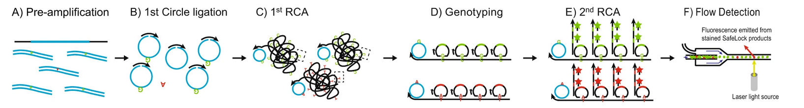

# SuperRCA

SuperRCA (Super Rolling Circle Amplification) is an advanced variation of the rolling circle amplification (RCA) technique, designed for ultra-sensitive and specific molecular detection. This method was first described by [Chen et al., 2022](<https://www.nature.com/articles/s41467-022-31397-y>) and has demonstrated capability in detecting single-nucleotide variants (SNVs), even in the presence of a 100,000-fold excess of normal/wild-type (wt) DNA.

SuperRCA is carried out in six relatively simple but distinct steps:

1. **Pre-amplification of Target DNA**: The target DNA sequences are enriched through pre-amplification, increasing the availability of DNA molecules for subsequent circularization/ligation steps.
2. **Circularization of Target ssDNA**: Single-stranded DNA (ssDNA) molecules are circularized (with the help of a splint), forming closed DNA loops. This step is crucial for the rolling circle amplification process.
3. **First RCA Reaction**: Rolling circle amplification is initiated on the circular ssDNA targets, generating long concatemers. These concatemers consist of repeated copies of the original DNA sequence, encompassing both wild-type and mutant loci.
4. **Addition of Padlock Probes**: Sequence-specific padlock probes are introduced, designed to bind selectively to either wild-type or mutant loci. The probes are ligated to the target sequences present in the RCA products, ensuring accurate discrimination between SNVs.
5. **Second RCA Reaction and Signal Amplification**: The ligated padlock probes serve as templates for a second RCA reaction, further amplifying the regions of interest. Detection is achieved using molecular beacons that hybridize to the amplified loci, generating fluorescent signals.
6. **Detection of SuperRCA Products**: The final SuperRCA products are large, concatemeric, fluorescent structures. These can be detected and quantified using standard flow cytometry or fluorescence imaging techniques, enabling high sensitivity and precision in distinguishing mutant molecules from wild-type DNA.

*source: Figure 1 [Chen et al., 2022](<https://www.nature.com/articles/s41467-022-31397-y>)*

This highly sensitive method is a significant advancement in molecular diagnostics, offering robust detection of low-abundance mutations within complex DNA backgrounds.
