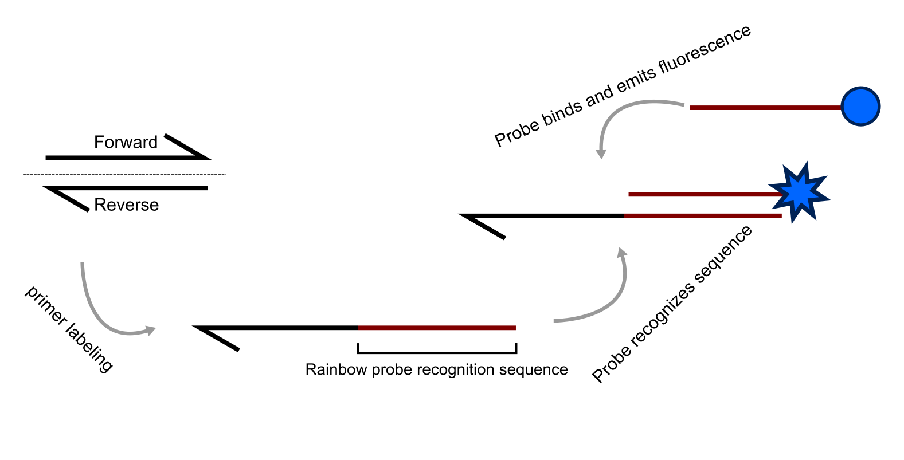

# Rainbow Probes

Rainbow probes are an invention belonging to [Pxlence](www.pxlence.com). These probes are an alternative to TaqMan hydrolysis probes. However, they are typically used at much lower concentrations and, instead of recognizing a target sequence flanked by primers (as TaqMan probes do), they bind to one of the modified primers. This means that one of the sequence-specific primers is pre-labeled with a Rainbow probe recognition sequence.

The three main advantages of using Rainbow probes are:

- Lower final concentrations of Rainbow probes per reaction reduce costs.
- Rainbow probes recognize a synthetic recognition sequence included in one of the primers, eliminating the need for probe-specific reaction optimization.
- Since only a specific primer pair is required, much shorter amplicons (e.g., <50 bp) can be detected, potentially improving efficiency and sensitivity.

However, their performance in detecting mutations and short sequence edits remains unclear. For more information, refer to [Pxlence](www.pxlence.com) and their [Rainbow probe brochure](https://www.pxlence.com/imgs/brochures/rbo_brochure_2025.pdf).

\
*Rainbow probe mediated amplicon detection. Based on the [Rainbow probe brochure](https://www.pxlence.com/imgs/brochures/rbo_brochure_2025.pdf)*
