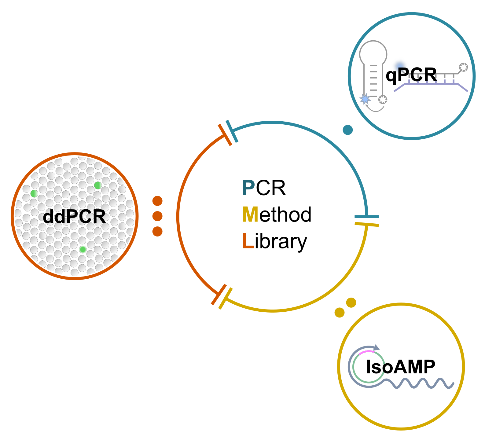

# Amplification method repository
This amplification method hub includes cool & interesting, primarily PCR, methods and guides.

More info on the background and purpose of this website can be found in the [About](https://pauliusbaltrusis.github.io/about.html) directory.

If you see something incorrect or out of place, reach out via [About](https://pauliusbaltrusis.github.io/about.html).

----
